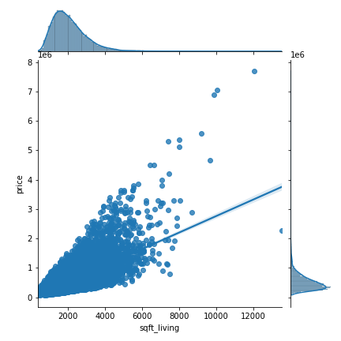
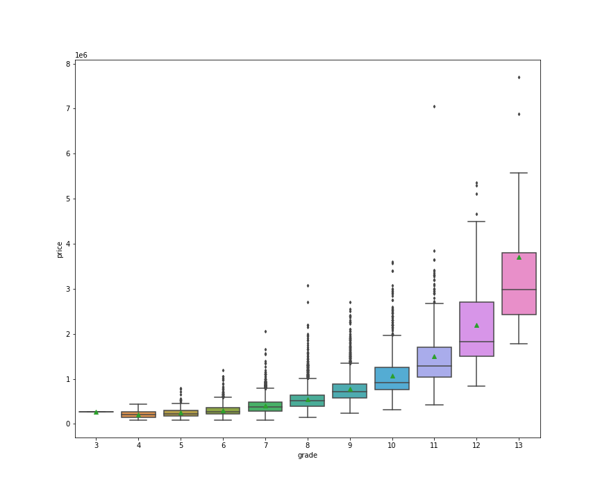
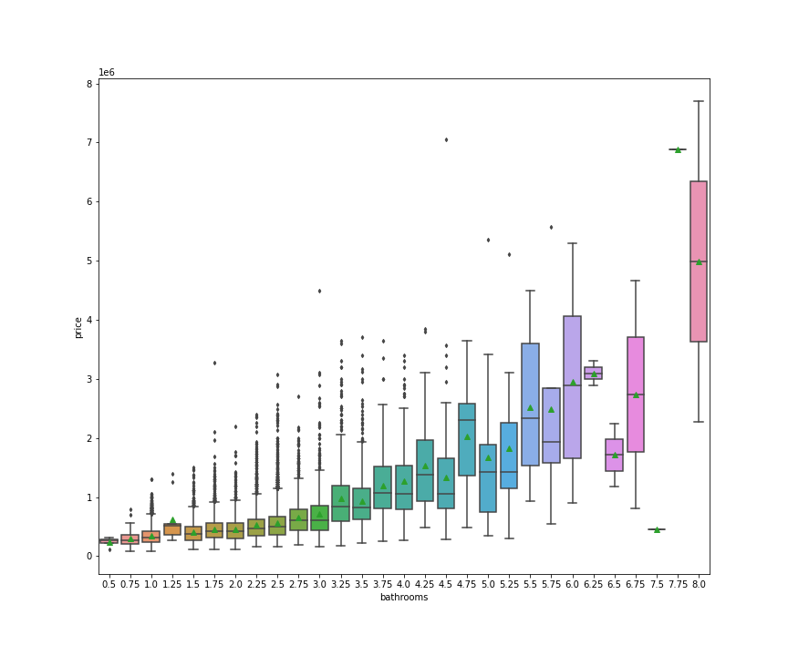
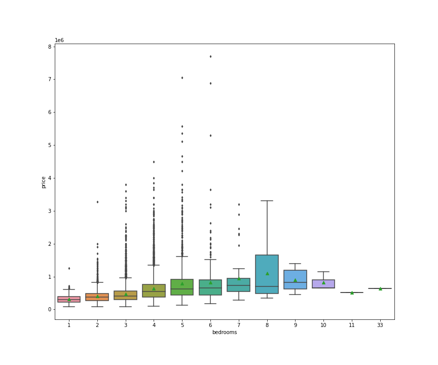
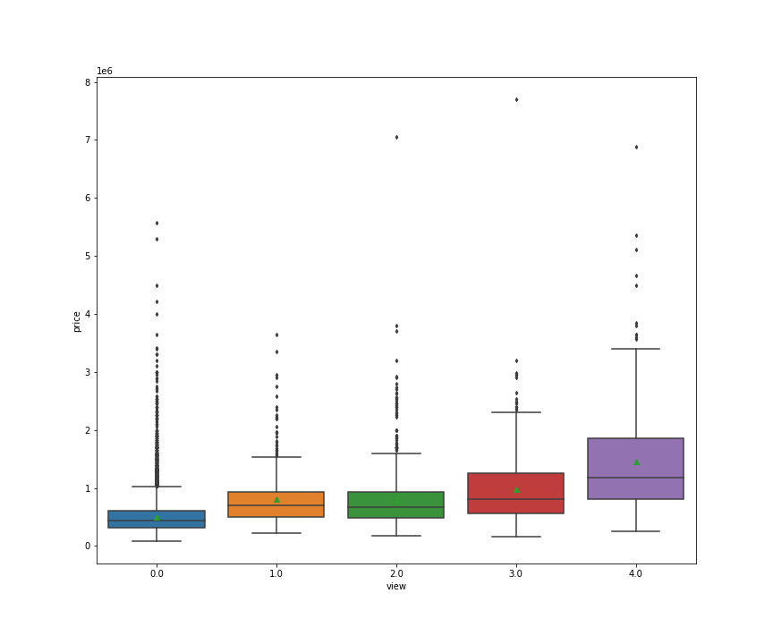
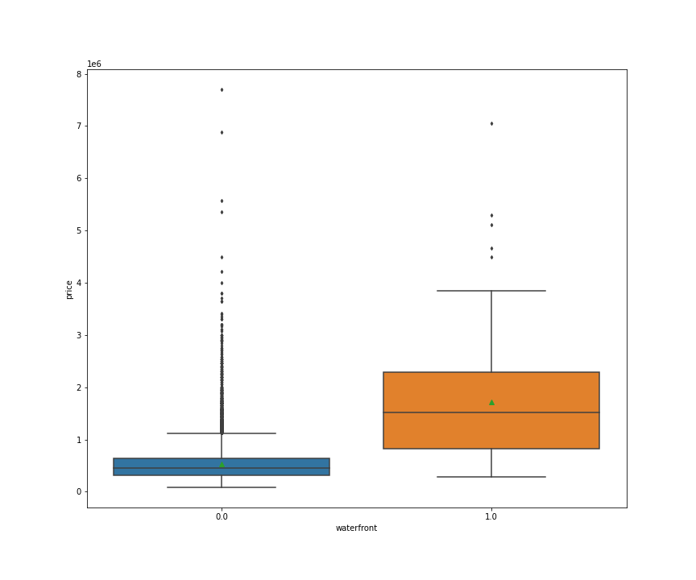
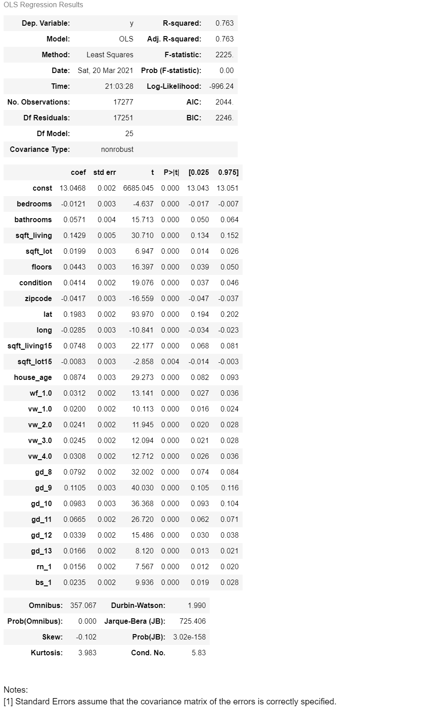

## Business Problem
D.R.Horton, as one of the biggest housing development companies, is searching for qualities that lead to higher home sale prices in King County, Washington. Our goal is to develop models to make predictions about the sale price of houses based on certain variables or features, so they can be used to make profitable decisions by D.R.Horton. 
## Hypothesis
- Null Hypothesis: There is no relationship between features and sale price of houses.

- Alternative Hypothesis: There is a relationship between features and sale price of houses.

- A significance level (alpha) of 0.05 will being used to make the determination, and will make the final recommendations accordingly.
## Data Description
King County House Data: a dataset that we were provided at the onset of the project. This file contains data for 21,597 homes built in King County from 1900 to 2015. Each home in the set contains information regarding features such as number of bedrooms/bathrooms, number of floors, square footage, zip code, condition, and more.
## Methods
I imported data from King County house data. I then cleaned the data such as replacing unnecessary data and filling the missing data with the most frequent data. I also did a little bit data feature engineering such as calculate 'house age' by using 'sold year' to minus 'yr_built'. I utilized descriptive statistics as well as visualizations to illuminate trends in different data feature. And then I built multiple linear regression models to determine our stongest correlations and evaluated each model and then returned to data to see what could be added, change, or removed to achieve a more successful model. This approach was appropriate for analyzing the common attributes of higher-priced homes so that I could make predictions and informed recommendations. 
## Results
### Data Visualization 
| Features        | Correlation  |
|---------------|-----------|        
| price         | 1.000000  |
| sqft_living   | 0.701917  |
| grade         | 0.667951  |
| sqft_above    | 0.605368  |
| sqft_living15 | 0.585241  |
| bathrooms     | 0.525906  |
| view          | 0.393497  |
| sqft_basement | 0.321108  |
| bedrooms      | 0.308787  |
| lat           | 0.306692  |
| waterfront    | 0.264306  |
| floors        | 0.256804  |
| yr_renovated  | 0.117855  |
| sqft_lot      | 0.089876  |
| sqft_lot15    | 0.082845  |
| condition     | 0.036056  |
| long          | 0.022036  |
| zipcode       | -0.053402 |
| house_age     | -0.053890  |

There is a positive correlation between square-feet of living and home sale price. As square footage of living space increases, house price increases. 

There is a positive correlation between building grade and home sale price. As the grade designation increases (scale of 1-13), house price also increases.

Bathrooms, bedrooms, view and water front are stronly associated with price. In case of view and bathrooms and bedrooms, price increases as their number increase. Houses having a waterfron are valued higher. 
### Model Testing
For my final input,I used 26 variables.I used a 80-20 train-test split cross-validation to train my model.I built a multiple linear regression model which combines all the features into a single model. 

In order to get my model more improved, I applied polynomial  regression, with powers up to two to add complexity. The polynomial features are the base features squared  and also the base features all multiplied in pairs.The R2 value imporved slightly after adding polynomial regression with degree 2.
 
## Conclusions
Our best model had an R-squared value of 0.79, telling us that the model fit the data with an accuracy of 79%. The absolute mean average error of predicted house price is 100k, which is quite decent. After reviewing this final model, I felt confident in our recommendations that all of our available features except house_age be considered by home developers in order to increase selling price. Sqare-feet of living space, grade, bathrooms, bedrooms, latitude, waterfront, floors, renovated year, sqft_lot, condition and zipcode all play a valuable role in predicting the price of a house in King County.

The prob(F-statistic) of 0.00 tells us that there is an extremely low probability of achieving these results with the null hypothesis being true, and tells us that our regression is meaningful. Our p-values for our features are well below our alpha or significance level, showing that they are each contributing to the model significantly. With an alpha of 0.05, at a confidence level of 95%, we reject the null hypothesis that there is no relationship between our features and our target variable, price.
## Recommendations
The recommendations are as follows:

-   increase square-footage of living space. 
-   increase the number of bedrooms and bathrooms as the square feet of houses increase.
-   attain the highest possible building grade
-   build and develop homes with waterfront
-   build and develop homes with good view

By following the above recommendations, a housing development company in King County can increase their chances of selling higher-priced homes.
## Future Work
In the future, my next steps would be reducing noise in the data to improve the accuracy of our model. I also would be Investigating more on the house location's importance to the house's price. For example, to see how the distance to the top schools or the distance to the supermarket impact on the house price.  Additionally, I would like to investigate certain features, such as constructional/architectural values of the house, to see what trends we could discern from that.